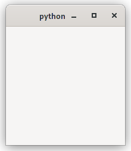
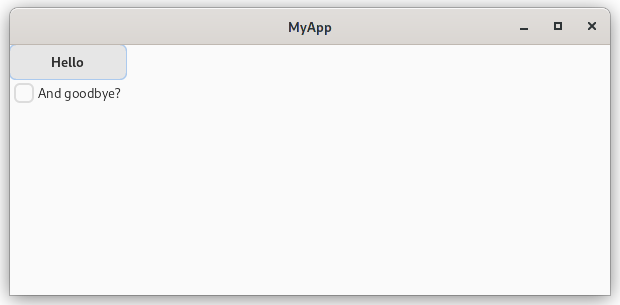
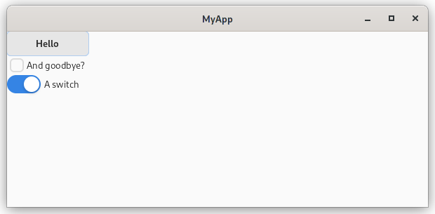
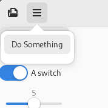
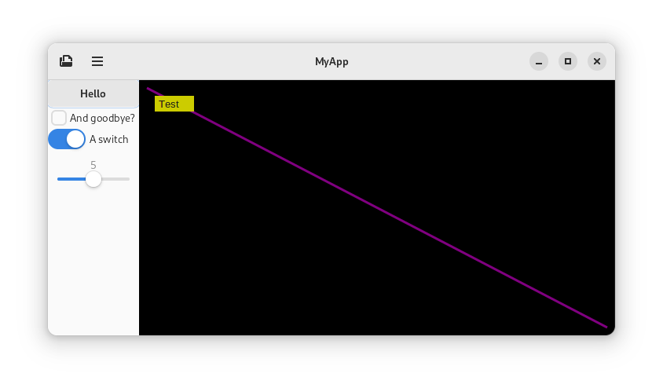
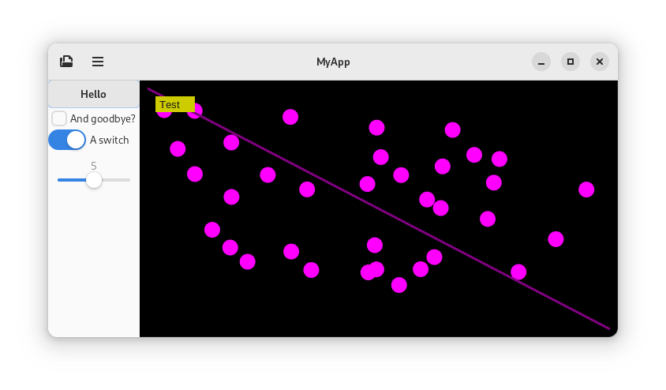
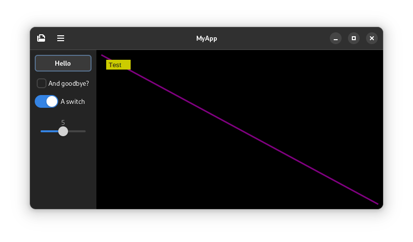
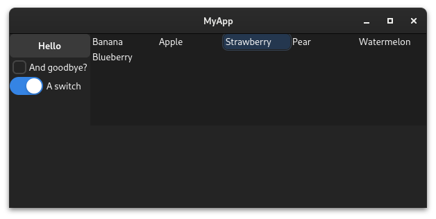
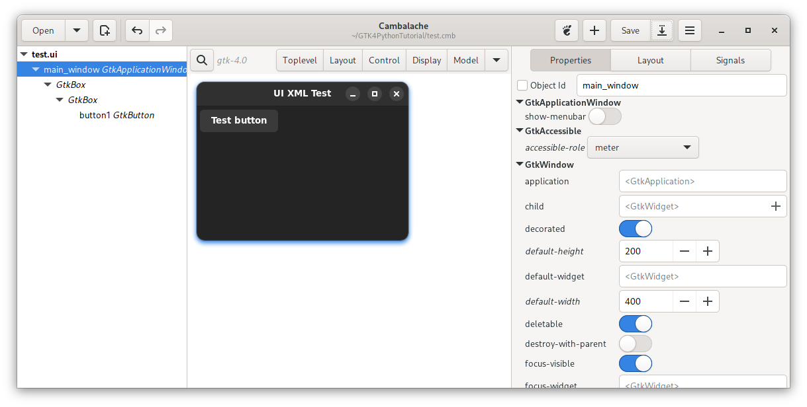

# Taiko's GTK4 Python tutorial

Wanna make apps for Linux but not sure how to start with GTK? This guide will hopefully help!
The intent is to show you how to do some common things with basic code examples so that you can get up and running making your own GTK app quickly.

Ultimately you want to be able to refer to the official documentation [here](https://docs.gtk.org/gtk4/) yourself. But I find it can be hard getting started
without an initial understanding of how to do things. The code examples here should hopefully help.

How to use this tutorial: You can either follow along or just use it to refer to specific examples.

Prerequisites: You have learnt the basics of Python. Ideally have some idea of how classes work. You will also need the following packages installed on your system: GTK4, PyGObject and Libadwaita.

Topics covered:

 - A basic GTK window
 - Widgets: Button, check button, switch, slider
 - Layout: Box layout
 - Adding a header bar
 - Showing an open file dialog
 - Adding a menu-button with a menu
 - Adding an about dialog
 - "Open with" and single instancing
 - Custom drawing with Cairo
 - Handling mouse input
 - Setting the cursor
 - Setting dark colour theme
 - Spacing and padding
 - Selection Grid
 - Custom drawing with Snapshot
 - Setting the app icon
 - UI from graphical designer

For beginners, I suggest walking through each example and try to understand what each line is doing. I also recommend taking a look at the docs for each widget.

It can be helpful to view the [GTK4 Widget Gallery](https://docs.gtk.org/gtk4/visual_index.html) which shows you all the common widgets. 

For Adwaita widgets also see [Adwaita Widget Gallery](https://gnome.pages.gitlab.gnome.org/libadwaita/doc/main/widget-gallery.html). Though for this tutorial i'll focus on standard GTK4 style widgets.


## A most basic program

```python
import gi
gi.require_version('Gtk', '4.0')
from gi.repository import Gtk

def on_activate(app):
    win = Gtk.ApplicationWindow(application=app)
    win.present()

app = Gtk.Application()
app.connect('activate', on_activate)

app.run(None)

```

This should display a small blank window.



This is a minimal amount of code to show a window. But we will start off with a better example:

 - Making the code into classes. 'Cause doing it functional style is a little awkward in Python.
 - Switching to **Libadwaita**, since many GNOME apps now use its new styling.
 - Pass in the app arguments.
 - Give the app an application id.

Here's what we got now:

### A better structured basic GTK4 + Adwaita


```python
import sys
import gi
gi.require_version('Gtk', '4.0')
gi.require_version('Adw', '1')
from gi.repository import Gtk, Adw


class MainWindow(Gtk.ApplicationWindow):
    def __init__(self, *args, **kwargs):
        super().__init__(*args, **kwargs)
        # Things will go here

class MyApp(Adw.Application):
    def __init__(self, **kwargs):
        super().__init__(**kwargs)
        self.connect('activate', self.on_activate)

    def on_activate(self, app):
        self.win = MainWindow(application=app)
        self.win.present()

app = MyApp(application_id="com.example.GtkApplication")
app.run(sys.argv)

```

Soo we have an instance of an app class and a window which we extend! We run our app and it makes a window!

> **Tip:** Don't worry too much if you don't understand the `__init__(self, *args, **kwargs)` stuff for now.

> **Tip:** For a serious app, you'll need to think of your own application id. It should be the reverse of a domain or page you control. If you don't have your own domain you can do like "com.github.me.myproject".


### So! What's next?

Well, we want to add something to our window. That would likely be a ***layout*** of some sort!

Most basic layout is a [Box](https://docs.gtk.org/gtk4/class.Box.html).

Lets add a box to the window! (Where the code comment "*things will go here*" is above)

```python
self.box1 = Gtk.Box()
self.set_child(self.box1)
```

We make a new box, and attach it to the window. Simple. If you run the app now you'll see no difference, because there's nothing in the layout yet either.


## Add a button!

One of the most basic widgets is a [Button](https://docs.gtk.org/gtk4/class.Button.html). Let's make one and add it to the layout.

```python
self.button = Gtk.Button(label="Hello")
self.box1.append(self.button)
```

Now our app has a button! (The window will be small now)

But it does nothing when we click it. Let's connect it to a function! Make a new method that prints hello world, and we connect it! 

Here's our MainWindow so far:

```python
class MainWindow(Gtk.ApplicationWindow):
    def __init__(self, *args, **kwargs):
        super().__init__(*args, **kwargs)
        self.box1 = Gtk.Box(orientation=Gtk.Orientation.VERTICAL)
        self.set_child(self.box1)

        self.button = Gtk.Button(label="Hello")
        self.box1.append(self.button)
        self.button.connect('clicked', self.hello)

    def hello(self, button):
        print("Hello world")
```

Cool eh?

By the way the ***Box*** layout lays out widgets in like a vertical or horizontal order. We should set the orientation of the box. See the change:

```python
self.box1 = Gtk.Box(orientation=Gtk.Orientation.VERTICAL)
```

## Set some window parameters

```python
self.set_default_size(600, 250)
self.set_title("MyApp")
```

## More boxes

You'll notice our button is stretched with the window. Let's add two boxes inside that first box we made. 

```python
self.box1 = Gtk.Box(orientation=Gtk.Orientation.HORIZONTAL)
self.box2 = Gtk.Box(orientation=Gtk.Orientation.VERTICAL)
self.box3 = Gtk.Box(orientation=Gtk.Orientation.VERTICAL)

self.button = Gtk.Button(label="Hello")
self.button.connect('clicked', self.hello)

self.set_child(self.box1)  # Horizontal box to window
self.box1.append(self.box2)  # Put vert box in that box
self.box1.append(self.box3)  # And another one, empty for now

self.box2.append(self.button) # Put button in the first of the two vertial boxes
```

Now that's more neat!

## Add a check button!

So, we know about a button, next lets add a [Checkbutton](https://docs.gtk.org/gtk4/class.CheckButton.html).

```python
    ...
    self.check = Gtk.CheckButton(label="And goodbye?")
    self.box2.append(self.check)


def hello(self, button):
    print("Hello world")
    if self.check.get_active():
        print("Goodbye world!")
        self.close()
```




When we click the button, we can check the state of the checkbox!

### Extra Tip: Radio Buttons

Check buttons can be turned into radio buttons by adding them to a group. You can do it using the `.set_group` method like this:

```python
radio1 = Gtk.CheckButton(label="test")
radio2 = Gtk.CheckButton(label="test")
radio3 = Gtk.CheckButton(label="test")
radio2.set_group(radio1)
radio3.set_group(radio1)
```

You can handle the toggle signal like this:

```python
radio1.connect("toggled", self.radio_toggled)
```

Replace `self.radio_toggled` with your own function. 

When connecting a signal it's helpful to pass additional parameters like as follows. This way you can have one function handle events from multiple widgets. Just don't forget to handle 
the extra parameter in your handler function.


```python
radio1.connect("toggled", self.radio_toggled, "test")
```

(This can apply to other widgets too)


## Add a switch

For our switch, we'll want to put our switch in a ***Box***, otherwise it'll look all stretched.

```python
        ...
        self.switch_box = Gtk.Box(orientation=Gtk.Orientation.HORIZONTAL)

        self.switch = Gtk.Switch()
        self.switch.set_active(True)  # Let's default it to on
        self.switch.connect("state-set", self.switch_switched) # Lets trigger a function

        self.switch_box.append(self.switch)
        self.box2.append(self.switch_box)

    def switch_switched(self, switch, state):
        print(f"The switch has been switched {'on' if state else 'off'}")
```

Try it out!

Our switch is looking rather nondescript, so let's add a label to it!
 

## ...with a Label

A label is like a basic line of text

```python
self.label = Gtk.Label(label="A switch")
self.switch_box.append(self.label)
self.switch_box.set_spacing(5) # Add some spacing

```

It should look like this now:



The file `part1.py` is an example of the code so far.

## Adding your custom CSS stylesheet

Did you know you can use **some** CSS rules in GTK? 
Lets create a new `style.css` file that we can use to apply properties to our new label:

```css
/* Let's create a title class */
.title {
    font-size: 25px;
    font-weight: bold;
}
```

Then, we need to load the CSS file in our application; to achieve this, we need a [CssProvider](https://docs.gtk.org/gtk4/class.CssProvider.html).

```python
# first, we need to add Gdk to our imports
from gi.repository import Gtk, Gdk

css_provider = Gtk.CssProvider()
css_provider.load_from_path('style.css')
Gtk.StyleContext.add_provider_for_display(Gdk.Display.get_default(), css_provider, Gtk.STYLE_PROVIDER_PRIORITY_APPLICATION)
```

Finally, we can add the `title` class to our `label`

```python 
self.label.set_css_classes(['title'])
```


## Adding a slider (Aka scale)

Here's an example of adding a [Scale](https://docs.gtk.org/gtk4/ctor.Scale.new.html) with a range from 0 to 10

```python
        self.slider = Gtk.Scale()
        self.slider.set_digits(0)  # Number of decimal places to use
        self.slider.set_range(0, 10)
        self.slider.set_draw_value(True)  # Show a label with current value
        self.slider.set_value(5)  # Sets the current value/position
        self.slider.connect('value-changed', self.slider_changed)
        self.box2.append(self.slider)

    def slider_changed(self, slider):
        print(int(slider.get_value()))
```

## Adding a button into the header bar

First we need to make a header bar

```python
        self.header = Gtk.HeaderBar()
        self.set_titlebar(self.header)
```

Simple.

Now add a button

```python
        self.open_button = Gtk.Button(label="Open")
        self.header.pack_start(self.open_button)
```

We already know how to connect a function to the button, so I've omitted that.

Done! But... it would look nicer with an icon rather than text.

```python
        self.open_button.set_icon_name("document-open-symbolic")
```

This will be an icon name from the icon theme. 

For some defaults you can take a look at `/usr/share/icons/Adwaita/scalable/actions`.

If you were adding a new action icon it would go in `/usr/share/icons/hicolor/scalable/actions`

> **Help! Todo!** Is this the best way? How do icons work in a development environment?
> 

## Adding a file chooser

Here we use [***Gtk.FileDialog***](https://docs.gtk.org/gtk4/class.FileDialog.html) to present an open file dialog to the user.

```python
        self.open_dialog = Gtk.FileDialog.new()
        self.open_dialog.set_title("Select a File")
        
    def show_open_dialog(self, button):
        self.open_dialog.open(self, None, self.open_dialog_open_callback)
        
    def open_dialog_open_callback(self, dialog, result):
        try:
            file = dialog.open_finish(result)
            if file is not None:
                print(f"File path is {file.get_path()}")
                # Handle loading file from here
        except GLib.Error as error:
            print(f"Error opening file: {error.message}")
     
```

Adding a filter and setting it as the default:

```python
        f = Gtk.FileFilter()
        f.set_name("Image files")
        f.add_mime_type("image/jpeg")
        f.add_mime_type("image/png")

        filters = Gio.ListStore.new(Gtk.FileFilter)  # Create a ListStore with the type Gtk.FileFilter
        filters.append(f)  # Add the file filter to the ListStore. You could add more.

        self.open_dialog.set_filters(filters)  # Set the filters for the open dialog
        self.open_dialog.set_default_filter(f)
````


## Adding a button with menu

For this there are multiple new concepts we need to introduce:

 - The [***MenuButton***](https://docs.gtk.org/gtk4/class.MenuButton.html) widget.
 - The [***Popover***](https://docs.gtk.org/gtk4/class.Popover.html), but here we will use a [***PopoverMenu***](https://docs.gtk.org/gtk4/class.PopoverMenu.html) which is built using an abstract menu model.
 - A [***Menu***](https://docs.gtk.org/gio/class.Menu.html). This is an abstract model of a menu.
 - [***Actions***](https://docs.gtk.org/gio/class.SimpleAction.html). An abstract action that can be connected to our abstract menu.

So, we click a MenuButton, which shows a Popover that was generated from a MenuModel that is composed of Actions.

First make sure `Gio` is added to the list of things we're importing from  `gi.repository`:

```python
from gi.repository import Gtk, Adw, Gio
```

```python
        # Create a new "Action"
        action = Gio.SimpleAction.new("something", None)
        action.connect("activate", self.print_something)
        self.add_action(action)  # Here the action is being added to the window, but you could add it to the
                                 # application or an "ActionGroup"

        # Create a new menu, containing that action
        menu = Gio.Menu.new()
        menu.append("Do Something", "win.something")  # Or you would do app.something if you had attached the
                                                      # action to the application

        # Create a popover
        self.popover = Gtk.PopoverMenu()  # Create a new popover menu
        self.popover.set_menu_model(menu)

        # Create a menu button
        self.hamburger = Gtk.MenuButton()
        self.hamburger.set_popover(self.popover)
        self.hamburger.set_icon_name("open-menu-symbolic")  # Give it a nice icon

        # Add menu button to the header bar
        self.header.pack_start(self.hamburger)

    def print_something(self, action, param):
        print("Something!")

```

## Add an about dialog

```python
from gi.repository import Gtk, Adw, Gio, GLib  # Add GLib to imports
```

```python
        # Set app name
        GLib.set_application_name("My App")

        # Create an action to run a *show about dialog* function we will create 
        action = Gio.SimpleAction.new("about", None)
        action.connect("activate", self.show_about)
        self.add_action(action)
        
        menu.append("About", "win.about")  # Add it to the menu we created in previous section

    def show_about(self, action, param):
        self.about = Gtk.AboutDialog()
        self.about.set_transient_for(self)  # Makes the dialog always appear in from of the parent window
        self.about.set_modal(self)  # Makes the parent window unresponsive while dialog is showing

        self.about.set_authors(["Your Name"])
        self.about.set_copyright("Copyright 2022 Your Full Name")
        self.about.set_license_type(Gtk.License.GPL_3_0)
        self.about.set_website("http://example.com")
        self.about.set_website_label("My Website")
        self.about.set_version("1.0")
        self.about.set_logo_icon_name("org.example.example")  # The icon will need to be added to appropriate location
                                                 # E.g. /usr/share/icons/hicolor/scalable/apps/org.example.example.svg

        self.about.set_visible(True)

```

### add about window (better About Dialog)
```python
         dialog = Adw.AboutWindow(transient_for=app.get_active_window()) 
         dialog.set_application_name("App name") 
         dialog.set_version("1.0") 
         dialog.set_developer_name("Developer") 
         dialog.set_license_type(Gtk.License(Gtk.License.GPL_3_0)) 
         dialog.set_comments("Adw about Window example") 
         dialog.set_website("https://github.com/Tailko2k/GTK4PythonTutorial") 
         dialog.set_issue_url("https://github.com/Tailko2k/GTK4PythonTutorial/issues") 
         dialog.add_credit_section("Contributors", ["Name1 url"]) 
         dialog.set_translator_credits("Name1 url") 
         dialog.set_copyright("© 2022 developer") 
         dialog.set_developers(["Developer"]) 
         dialog.set_application_icon("com.github.devname.appname") # icon must be uploaded in ~/.local/share/icons or /usr/share/icons

         dialog.set_visible(True)
```
For further reading on what you can add, see [***AboutDialog***](https://docs.gtk.org/gtk4/class.AboutDialog.html).



## "Open with" and single instancing

> Note that I haven't fully tested the code in this section

We already covered how to open a file with an explicit dialog box, but there are other ways users might want to open a file
with our application, such as a command line argument, or when they click "Open with" in their file browser etc.

Also, when the user launches another instance, we may want to determine the behavior of if the file is opened in the original
window or a new one. Fortunately, GTK handles most of the hard work for us, but there are some things we need to do if we want handle file opening.

By default, our [GApplication](https://docs.gtk.org/gio/class.Application.html) will maintain the first process as the primary process, and if
a second process is launched, one of two signals will be called on that first primary process, with the 2nd process promptly exiting.

Those two signals are two possible entry points to our app; `activate` which we already implemented, and `open` which we haven't yet implemented. The open function handles the opening of files.

Currently, in our example app, `activate` will launch another identical window. (The app will exit when all windows are closed)

So what if we wanted only one window open at a time? Just detect if we have already opened a window and return from the activate function if we have.

Maintain a single instance:

```python
class MyApp(Adw.Application):
    def __init__(self, **kwargs):
        super().__init__(**kwargs)
        self.connect('activate', self.on_activate)
        self.win = None  # Forgot to add this originally

    def on_activate(self, app):
        if not self.win:  # added this condition
            self.win = MainWindow(application=app)
        self.win.present()  # if window is already created, this will raise it to the front
```

What about opening files? We need to implement that function:

```python
class MyApp(Adw.Application):
    def __init__(self, **kwargs):
        super().__init__(**kwargs)
        self.connect('activate', self.on_activate)
        self.connect('open', self.on_open)
        self.set_flags(Gio.ApplicationFlags.HANDLES_OPEN)  # Need to tell GApplication we can handle this
        self.win = None

    def on_activate(self, app):
        if not self.win:
            self.win = MainWindow(application=app)
        self.win.present()

   def on_open(self, app, files, n_files, hint):
        self.on_activate(app)  # Adding this because window may not have been created yet with this entry point
        for file in n_files:
            print("File to open: " + file.get_path())  # How you handle it from here is up to you, I guess
        
```

Note that an "Open with" option with your application would
require a `.desktop` file that registers a mime type that your application can open, but setting up a desktop
file is outside the scope of this tutorial.


## Custom drawing area using Cairo

There are two main methods of custom drawing in GTK4, the Cairo way and the Snapshot way. Cairo provides a more high level
drawing API but uses slow software rendering. Snapshot uses a little more low level API but uses much faster hardware accelerated rendering.

To draw with Cairo we use the [***DrawingArea***](https://docs.gtk.org/gtk4/class.DrawingArea.html) widget.

```python

        self.dw = Gtk.DrawingArea()

        # Make it fill the available space (It will stretch with the window)
        self.dw.set_hexpand(True)
        self.dw.set_vexpand(True)

        # Instead, If we didn't want it to fill the available space but wanted a fixed size
        #self.dw.set_content_width(100)
        #self.dw.set_content_height(100)

        self.dw.set_draw_func(self.draw, None)
        self.box3.append(self.dw)

    def draw(self, area, c, w, h, data):
        # c is a Cairo context

        # Fill background with a colour
        c.set_source_rgb(0, 0, 0)
        c.paint()

        # Draw a line
        c.set_source_rgb(0.5, 0.0, 0.5)
        c.set_line_width(3)
        c.move_to(10, 10)
        c.line_to(w - 10, h - 10)
        c.stroke()

        # Draw a rectangle
        c.set_source_rgb(0.8, 0.8, 0.0)
        c.rectangle(20, 20, 50, 20)
        c.fill()

        # Draw some text
        c.set_source_rgb(0.1, 0.1, 0.1)
        c.select_font_face("Sans")
        c.set_font_size(13)
        c.move_to(25, 35)
        c.show_text("Test")

```



Further resources on Cairo:

 - [PyCairo Visual Documentation](https://seriot.ch/pycairo/)

Note that Cairo uses software rendering. For accelerated rendering, Gtk Snapshot can be used, see sections further down below.

## Input handling in our drawing area

### Handling a mouse / touch event

```python
        ...
        evk = Gtk.GestureClick.new()
        evk.connect("pressed", self.dw_click)  # could be "released"
        self.dw.add_controller(evk)

        self.blobs = []

    def dw_click(self, gesture, data, x, y):
        self.blobs.append((x, y))
        self.dw.queue_draw()  # Force a redraw

    def draw(self, area, c, w, h, data):
        # c is a Cairo context

        # Fill background
        c.set_source_rgb(0, 0, 0)
        c.paint()

        c.set_source_rgb(1, 0, 1)
        for x, y in self.blobs:
            c.arc(x, y, 10, 0, 2 * 3.1415926)
            c.fill()
        ...

```



Ref: [GestureClick](https://docs.gtk.org/gtk4/class.GestureClick.html)

Extra example. If we wanted to listen to other mouse button types:

```python
        ...
        evk.set_button(0)  # 0 for all buttons
    def dw_click(self,  gesture, data, x, y):
        button = gesture.get_current_button()
        print(button)
```


See also: [EventControllerMotion](https://docs.gtk.org/gtk4/class.EventControllerMotion.html). Example:

```python
        evk = Gtk.EventControllerMotion.new()
        evk.connect("motion", self.mouse_motion)
        self.add_controller(evk)
    def mouse_motion(self, motion, x, y):
        print(f"Mouse moved to {x}, {y}")
```

See also: [EventControllerKey](https://docs.gtk.org/gtk4/class.EventControllerKey.html)

```python
        evk = Gtk.EventControllerKey.new()
        evk.connect("key-pressed", self.key_press)
        self.add_controller(evk)  # add to window
    def key_press(self, event, keyval, keycode, state):
        if keyval == Gdk.KEY_q and state & Gdk.ModifierType.CONTROL_MASK:   # Add Gdk to your imports. i.e. from gi.repository import Gdk
            self.close()
```

## Setting the cursor

We can set a cursor for a widget.

First we need to import **Gdk**, so we append it to this line like so:

```python
from gi.repository import Gtk, Adw, Gio, Gdk
```

Now setting the cursor is easy.

```python
        self.cursor_crosshair = Gdk.Cursor.new_from_name("crosshair")
        self.dw.set_cursor(self.cursor_crosshair)
```

You can find a list of common cursor names [here](https://docs.gtk.org/gdk4/ctor.Cursor.new_from_name.html).

# Setting a dark color scheme

We can use:

```python
        app = self.get_application()
        sm = app.get_style_manager()
        sm.set_color_scheme(Adw.ColorScheme.PREFER_DARK)
```

See [here](https://gnome.pages.gitlab.gnome.org/libadwaita/doc/1.0.0/styles-and-appearance.html) for more details.


# Spacing and padding

For a better look we can add spacing to our **layout**. We can also add a margin to any widget, here I've added a
margin to our **box** layout.

```python
        self.box2.set_spacing(10)
        self.box2.set_margin_top(10)
        self.box2.set_margin_bottom(10)
        self.box2.set_margin_start(10)
        self.box2.set_margin_end(10)
```



# Using GridView

Here Ill show how to make a [***GridView***](https://docs.gtk.org/gtk4/class.GridView.html). The setup is similar for other wigets like ***ListView*** and ***ColumnsView***.



First lets make a GridView and attatch it to our second vert box.

```python

        self.grid1 = Gtk.GridView()
        self.box3.append(self.grid1)

        fruits = ["Banana", "Apple", "Strawberry", "Pear", "Watermelon", "Blueberry"]
```

That part was easy! But it gets a little more complicated from here. In order for these kinds of widgets to work we need two things, a  **model** and a **factory**.

Lets start with the **model**. The model will hold the basis for the information we want in each item in the grid.

First we can create an object that will hold the data we want for each item in the list/grid.

```python
        class Fruit(GObject.Object):
            name = GObject.Property(type=str)
            def __init__(self, name):
                super().__init__()
                self.name = name
```

Then we create each object and put them in a ListStore. Then from that ListStore we create a SelectionModel, in this case im using a *SingleSelection*.

Then we set that selection model as the model for the grid. 

```python
        self.ls = Gio.ListStore()

        for f in fruits:
            self.ls.append(Fruit(f))

        ss = Gtk.SingleSelection()
        ss.set_model(self.ls)

        self.grid1.set_model(ss)
```

Next we need a **factory**. The factory is what creates the widgets in the grid for each item in the model.

```python
        factory = Gtk.SignalListItemFactory()

        def f_setup(fact, item):
            label = Gtk.Label(halign=Gtk.Align.START)
            label.set_selectable(False)
            item.set_child(label)

        factory.connect("setup", f_setup)

        def f_bind(fact, item):
            item.get_child().set_label(item.get_item().name)

        factory.connect("bind", f_bind)

        self.grid1.set_factory(factory)

```

That should then work. 

The above is useful if the displayed data wont change, but if it is to change dynamically we need to "bind" the property so that any changes are synced. Here is a revised bind function using bind_property:

```python
        def f_bind(fact, item):
            fruit = item.get_item()
            fruit.bind_property("name",
              item.get_child(), "label",
              GObject.BindingFlags.SYNC_CREATE)
```

Any changes to the name will automatically update the display.

To get the selected item in the grid:

```python
print(ss.get_selected_item().name)
```

To detect when the selected item has changed:

```python
        def on_selected_items_changed(selection, position, n_items):
            selected_item = selection.get_selected_item()
            if selected_item is not None:
                print(f"Selected item changed to: {selected_item.name}")
        ss.connect("selection-changed", on_selected_items_changed)
```


To detect clicks on an item: ***TODO**


# Custom drawing with Snapshot

As mentioned in the Cairo section, Snapshot uses fast hardware accelerated drawing, but it's a little more complicated to
use. Treat this section as more of a general guide of how it works than a tutorial of how you should do things.

First, we create our own custom widget class which will implement the [***Snapshot***](https://docs.gtk.org/gtk4/class.Snapshot.html) virtual method. 
(To implement a virtual method we need to prepend `do_` to the name as it is in the docs.)

```python

class CustomDraw(Gtk.Widget):
    def __init__(self):
        super().__init__()

    def do_snapshot(self, s):
        pass
```

Then it can be added in the same way as any other widget. If we want to manually trigger a redraw we can use
the same `.queue_draw()` method call on it.

If we want the widget to have a dynamic size we can set the usual `.set_hexpand(True)`/`.set_vexpand(True)`, but if it
is to have a fixed size, you would need to implement the [**Measure**](https://docs.gtk.org/gtk4/vfunc.Widget.measure.html) virtual method.

Have a read of the [***snapshot***](https://docs.gtk.org/gtk4/class.Snapshot.html) docs. It's a little more complex, but once you know what you're doing you
could easily create your own helper functions. You can use your imagination!

Here's some examples:

### Draw a solid rectangle

Here we use:
 - [**RGBA Struct**](https://docs.gtk.org/gdk4/struct.RGBA.html)
 - [**Rect**](http://ebassi.github.io/graphene/docs/graphene-Rectangle.html)

```python
    def do_snapshot(self, s):
        colour = Gdk.RGBA()
        colour.parse("#e80e0e")
        
        rect = Graphene.Rect().__init__(10, 10, 40, 60)   # Add Graphene to your imports. i.e. from gi.repository import Graphene

        s.append_color(colour, rect)
```

### Draw a solid rounded rectangle / circle

This is a little more complicated...

 - [***RoundedRect***](https://docs.gtk.org/gsk4/struct.RoundedRect.html)

```python
        colour = Gdk.RGBA()
        colour.parse("rgb(159, 222, 42)") # another way of parsing

        rect = Graphene.Rect().init(50, 70, 40, 40)
        
        rounded_rect = Gsk.RoundedRect()  # Add Gsk to your imports. i.e. from gi.repository import Gsk
        rounded_rect.init_from_rect(rect, radius=20)  # A radius of 90 would make a circle
        
        s.push_rounded_clip(rounded_rect)
        s.append_color(colour, rect)
        s.pop()   # remove the clip
```

### Outline of rect / rounded rect / circle

Fairly straightforward, see [append_border](https://docs.gtk.org/gtk4/method.Snapshot.append_border.html).

### An Image

 - See [***Texture***](https://docs.gtk.org/gdk4/class.Texture.html).

```python
    texture = Gdk.Texture.new_from_filename("example.png")
    # Warning: For the purposes of demonstration ive shown this declared in our drawing function,
    #  but of course you would REALLY need to define this somewhere else so that its only called 
    # once as we don't want to reload/upload the data every draw call.
    
    # Tip: There are other functions to load image data from in memory pixel data
    
    rect = Graphene.Rect().__init__(50, 50, texture.get_width(), texture.get_height())  # See warning below
    s.append_texture(texture, rect)    

```

Warning: On a HiDPI display the logical and physical measurements may differ in scale, typically by a factor of 2. In most places
we're dealing in logical units but these methods give physical units. So... you might not want to define the size of the rectangle
by the texture.

### Text

Text is drawn using Pango layouts. Pango is quite powerful and really needs a whole tutorial on its own, but here's
a basic example of a single line of text:

```python
        colour = Gdk.RGBA()
        colour.red = 0.0    # Another way of setting colour
        colour.green = 0.0
        colour.blue = 0.0
        colour.alpha = 1.0

        font = Pango.FontDescription.new()
        font.set_family("Sans")
        font.set_size(12 * Pango.SCALE)  # todo how do we follow the window scaling factor?

        context = self.get_pango_context()
        layout = Pango.Layout(context)  # Add Pango to your imports. i.e. from gi.repository import Pango
        layout.set_font_description(font)
        layout.set_text("Example text")
        
        point = Graphene.Point()
        point.x = 50  # starting X co-ordinate
        point.y = 50  # starting Y co-ordinate
        
        s.save()
        s.translate(point)
        s.append_layout(layout, colour)
        s.restore()
    
```

## Setting the App Icon

How to set an icon for your app.

First make sure you created an application ID as mentioned near the begnning of this tutorial, e.g. `com.github.me.myapp`. 

Then your icon file(s) will go in the `hicolor` theme once you package your app. (hicolor is the base theme that all other themes inherit).

`/usr/share/icons/hicolor/128x128/apps/com.github.me.myapp.png` for a raster image for example, and/or 
`/usr/share/icons/hicolor/scalable/apps/com.github.me.myapp.svg` for vector.

(Or locally in `~/.local/share/icons/hicolor/...`)

A single svg is sufficent for GNOME, but other desktop environments may look for PNG's.

Typically you would store that hicolor directory structure in your project directory as `data/icons/hicolor/...`. When packaging you copy it to the appropriate location on the system.

Once you make a .desktop file, in it set the icon field to your app id: `Icon=com.github.me.myapp`. The icon will work once the .desktop file and icons are installed to the appropriate locations on your system.

**Q: OK but how do I programmatically set the icon of my window?**

**A:** In modern desktop Linux the idea is you don't. Wayland provides no mechanism for a client program to set an icon. How it works is the Wayland client sends your application ID to the window manager, its your window manager which then takes responsibility for picking the icon itself. This is done by referencing the .desktop file, where that application ID corresponds to the name of the desktop file.

## UI from Graphical Designer

It may be faster to mock up a UI in a graghical designer such as [Cambalache](https://flathub.org/apps/ar.xjuan.Cambalache). This will a give you a .ui file which your
GTK application can use to generate its UI.

In Cambalache try make a window, add some layouts, and a button. Its up to you. Make sure to set an object id for objects you want to reference in your code,
including the main window. When you click export it will generate a .ui XML file.



For my design I get the XML:

```xml
<?xml version='1.0' encoding='UTF-8'?>
<!-- Created with Cambalache 0.10.3 -->
<interface>
  <!-- interface-name test.ui -->
  <requires lib="gtk" version="4.6"/>
  <object class="GtkApplicationWindow" id="main_window">
    <property name="default-height">200</property>
    <property name="default-width">400</property>
    <property name="title">UI XML Test</property>
    <child>
      <object class="GtkBox">
        <child>
          <object class="GtkBox">
            <property name="margin-bottom">5</property>
            <property name="margin-end">5</property>
            <property name="margin-start">5</property>
            <property name="margin-top">5</property>
            <property name="orientation">vertical</property>
            <child>
              <object class="GtkButton" id="button1">
                <property name="halign">start</property>
                <property name="hexpand">True</property>
                <property name="label">Test button</property>
              </object>
            </child>
          </object>
        </child>
      </object>
    </child>
  </object>
</interface>
```

Then we can write our app in Python and load the UI using a [Builder](https://docs.gtk.org/gtk4/class.Builder.html).

```python
import sys
import gi
gi.require_version('Gtk', '4.0')
gi.require_version('Adw', '1')
from gi.repository import Gtk, Adw

class MyApp(Adw.Application):
    def __init__(self, **kwargs):
        super().__init__(**kwargs)
        self.connect('activate', self.on_activate)

    def on_activate(self, app):
        # Create a Builder
        builder = Gtk.Builder()
        builder.add_from_file("test.ui")

        # Obtain the button widget and connect it to a function
        button = builder.get_object("button1")
        button.connect("clicked", self.hello)

        # Obtain and show the main window
        self.win = builder.get_object("main_window")
        self.win.set_application(self)  # Application will close once it no longer has active windows attached to it
        self.win.present()

    def hello(self, button):
        print("Hello")

app = MyApp(application_id="com.example.GtkApplication")
app.run(sys.argv)

```

So in this method we simply obtain the objects defined by our XML using `builder.get_object()`

In the above example I get the button I created and connect it to a function.

***todo:*** using resoure files


## Todo...

Text box: [Entry](https://docs.gtk.org/gtk4/class.Entry.html) 

Number changer: [SpinButton](https://docs.gtk.org/gtk4/class.SpinButton.html)

Picture.

Custom Styles.


